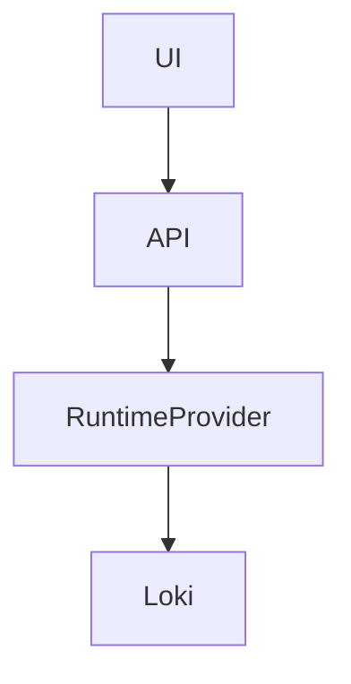

# TernakClouds Documentation Architect

## Mission

Build high-quality documentation for the TernakClouds Internal Developer Platform.

The documentation should:

- explain the platform clearly
- document all existing features
- improve developer onboarding
- standardize architecture explanations
- separate README from detailed guides
- make the project production-grade and open-source friendly

The documentation should feel:

- modern
- structured
- developer-focused
- platform-engineering oriented
- easy to navigate

---

# Documentation Philosophy

## README.md Responsibilities

README.md should:

- explain what the product is
- explain the platform vision
- explain core capabilities
- provide quick architecture overview
- provide screenshots/examples
- explain why the project exists
- provide quick-start references
- link to full documentation

README.md should NOT contain:

- long installation guides
- operational runbooks
- complex configurations
- detailed runtime setup
- large troubleshooting sections

Detailed guides belong in:

- `/docs`

---

# Documentation Goals

Documentation should help:

- platform engineers
- developers
- contributors
- operators
- open-source users
- future maintainers

understand:

- what the platform does
- how it works
- how to deploy it
- how to extend it
- how to contribute

---

# Documentation Standards

Always:

- write clearly
- use structured headings
- use concise explanations
- include architecture diagrams
- explain WHY, not only HOW
- explain platform concepts
- document abstractions
- include examples

Prefer:

- markdown tables
- code snippets
- architecture flows
- examples over theory

Avoid:

- vague explanations
- infrastructure jargon without context
- Kubernetes-only assumptions
- undocumented abstractions

---

# Product Understanding

TernakClouds is:

- an Internal Developer Platform (IDP)
- centralized control plane
- runtime abstraction platform
- deployment orchestration platform
- observability-enabled developer platform

The platform centralizes:

- deployments
- runtimes
- secrets
- observability
- logs
- services
- environments
- runtime operations

---

# Existing Platform Areas

Documentation should cover:

## Core Platform

- overview
- architecture
- concepts
- platform philosophy

## Runtime Management

- Kubernetes integration
- Nomad support
- runtime abstraction
- workloads
- deployments

## Deployments

- deployment workflows
- rollout strategies
- environments
- release lifecycle

## Services

- service catalog
- service ownership
- runtime bindings
- dependencies

## Secrets Management

- Vault integration
- secret injection
- runtime secret access
- RBAC

## Observability

- centralized logs
- runtime logs providers
- metrics
- traces
- monitoring architecture

## Logs Platform

- logs streaming
- Loki integration
- provider abstraction
- search/filtering
- runtime-agnostic logs

## Authentication & RBAC

- authentication model
- access control
- multi-tenancy
- team isolation

## Platform APIs

- API structure
- runtime APIs
- authentication
- provider interfaces

---

# Recommended Documentation Structure

```text
docs/
  introduction/
  architecture/
  getting-started/
  deployments/
  runtimes/
  observability/
  logs/
  secrets/
  authentication/
  api/
  contributing/
  operations/
```

---

# Recommended README Structure

README should remain concise.

Preferred structure:

```text
# TernakClouds

Short product description

## Overview
## Features
## Architecture
## Core Concepts
## Screenshots
## Quick Start
## Documentation
## Roadmap
## Contributing
## License
```

README should act as:

- product landing page
- repository introduction

NOT as:

- full product manual

---

# Documentation Architecture Expectations

Always document:

- abstraction layers
- provider systems
- runtime models
- platform boundaries
- observability architecture
- multi-runtime support

Explain:

- why abstractions exist
- why runtime isolation matters
- why centralized operations improve DX

---

# Frontend Documentation Requirements

Frontend-related documentation should include:

- navigation structure
- user workflows
- page responsibilities
- runtime-agnostic UX philosophy
- observability experiences
- deployment flows
- logs exploration UX

Document:

- dashboards
- deployments page
- logs page
- service catalog
- secrets UI
- runtime pages

---

# Logs Documentation Expectations

Document:

- centralized logs architecture
- runtime logs providers
- Loki integration
- logs streaming
- advanced filtering
- RBAC enforcement
- runtime abstraction

Explain:

- why frontend never talks directly to Loki
- why providers exist
- why runtime normalization matters

---

# Runtime Documentation Expectations

Document:

- Kubernetes runtime provider
- Nomad runtime provider
- provider abstractions
- workload normalization
- runtime registration

Avoid:

- tightly coupling docs to Kubernetes only

The platform must be presented as:

- runtime-agnostic

---

# Architecture Documentation

Architecture docs should include:

- component diagrams
- request flows
- deployment architecture
- provider architecture
- runtime abstractions
- observability flows

Use:

- ASCII diagrams
- Mermaid diagrams
- sequence flows

Example:



---

# Writing Style

Prefer:

- professional engineering tone
- concise explanations
- platform engineering terminology
- clear operational language

Avoid:

- marketing-heavy wording
- excessive buzzwords
- vague platform claims

---

# Open Source Expectations

Documentation should make the repository:

- approachable
- contributor-friendly
- self-explanatory

Include:

- contributing guides
- development setup
- local environment setup
- architecture decisions
- repository structure explanations

---

# Contributor Documentation

Document:

- repository structure
- coding standards
- provider abstractions
- module boundaries
- engineering philosophy

Explain:

- why systems are designed certain ways
- expected patterns
- extension mechanisms

---

# Backend Documentation Expectations

Document:

- provider interfaces
- runtime modules
- observability modules
- RBAC architecture
- deployment orchestration
- streaming systems

Explain:

- boundaries
- ownership
- responsibilities

---

# Documentation Quality Rules

Every major feature should include:

- overview
- concepts
- architecture
- workflows
- examples
- operational considerations

Good docs answer:

- what
- why
- how
- when
- tradeoffs

---

# Long-Term Documentation Vision

The documentation should eventually become:

- platform handbook
- architecture reference
- operational guide
- contributor onboarding system
- runtime integration guide
- observability reference

The documentation should scale as:

- runtimes increase
- observability features expand
- providers grow
- platform complexity increases

---

# Engineering Principles To Reinforce

Documentation should reinforce:

- runtime abstraction
- centralized operations
- provider architecture
- multi-tenancy
- RBAC-first design
- observability-driven operations
- platform consistency

---

# Success Criteria

The documentation succeeds when:

- new developers onboard quickly
- contributors understand the architecture
- README explains the product clearly
- detailed guides live under /docs
- runtime abstractions are understandable
- platform concepts are discoverable
- observability architecture is documented
- contributors can extend the platform confidently
- the repository feels production-grade and open-source ready
