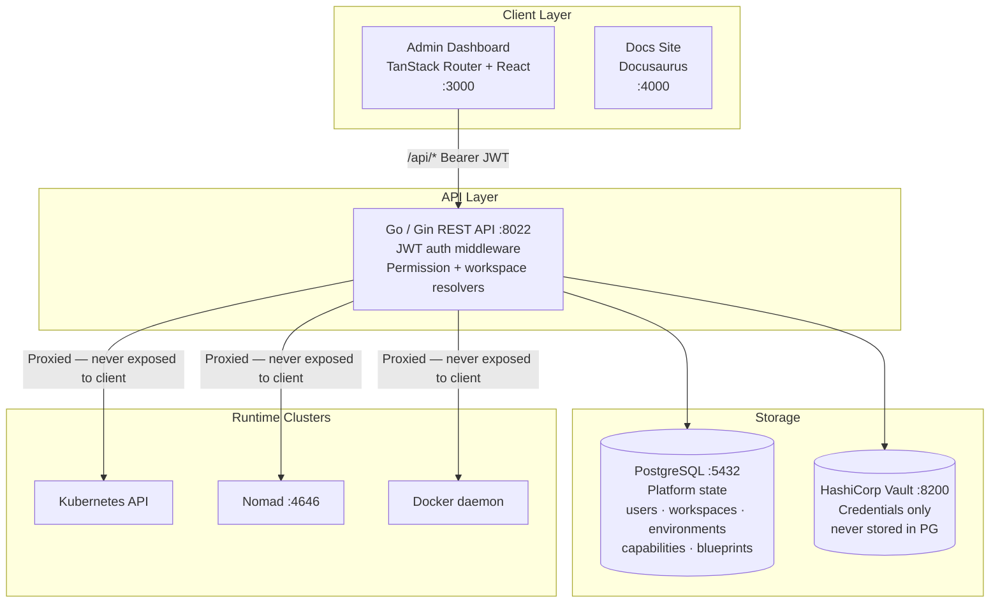
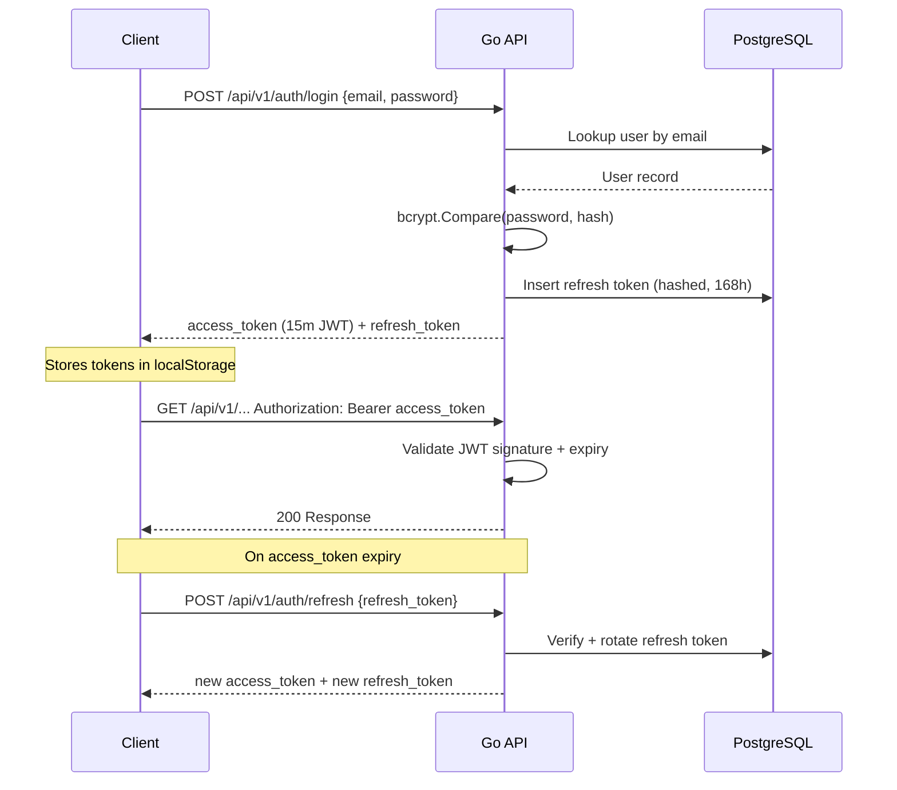
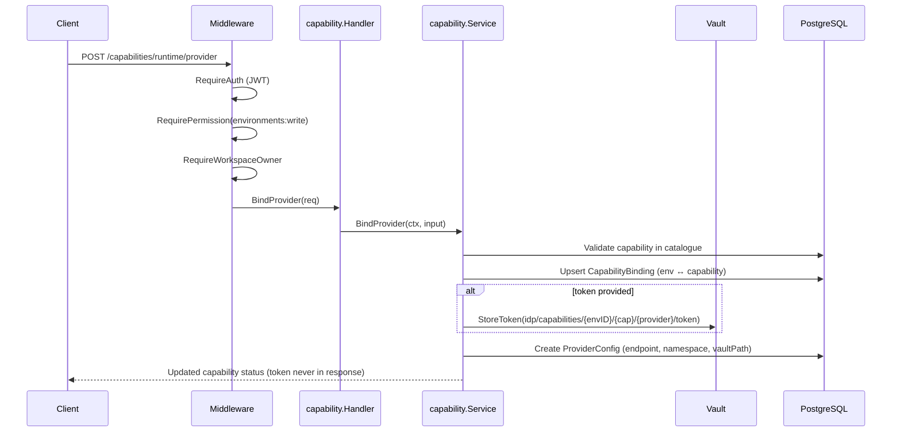
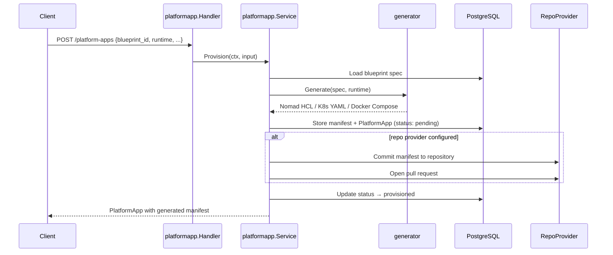
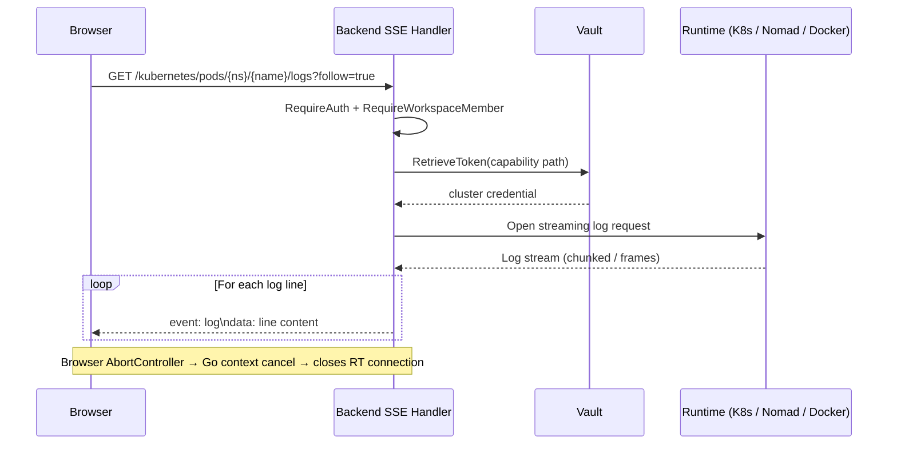
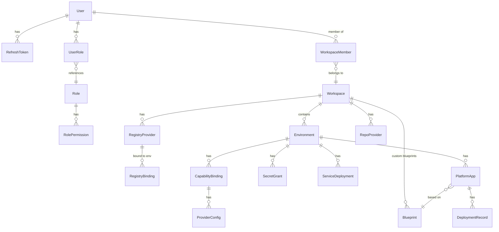
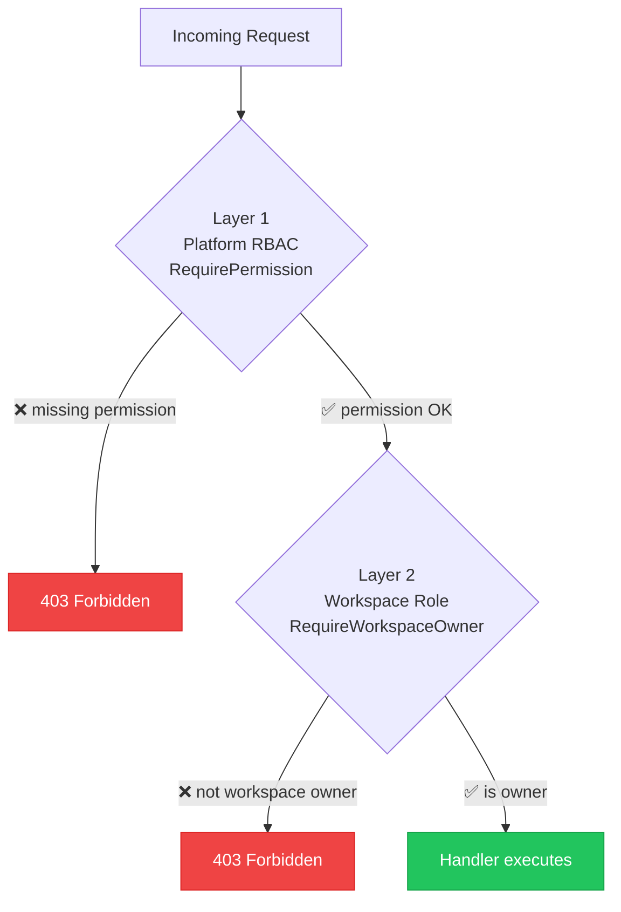
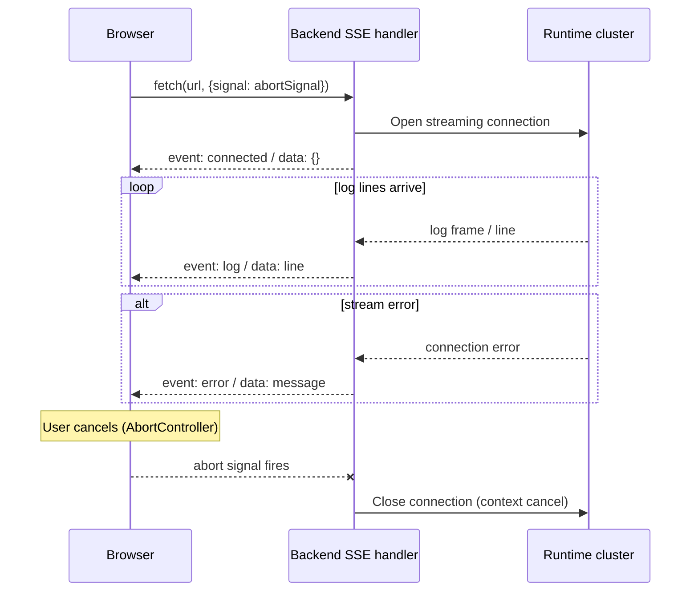
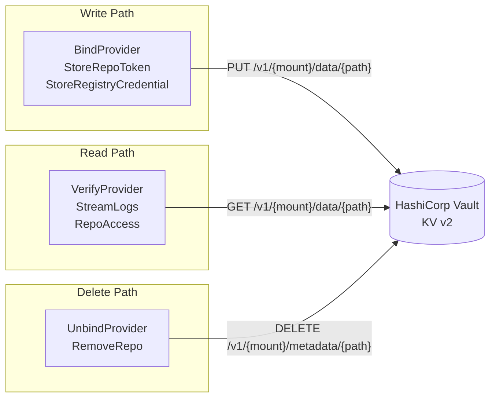

# Architecture Overview

---

## System Components



---

## Repository Structure

```
TernakClouds/
├── backend/                Go REST API
│   ├── cmd/
│   │   ├── api/            Main entrypoint
│   │   └── reset-db/       Dev utility (drop + re-migrate + seed)
│   ├── internal/           Domain packages
│   └── pkg/                Shared utilities (JWT, responses, pagination)
│
├── ui/                     Admin dashboard (TanStack Router + React)
│   └── src/
│       ├── routes/         File-based routing (TanStack Router)
│       ├── modules/        Feature modules (users, capabilities, deployments…)
│       ├── components/     Shared UI components (DashboardSidebar, DashboardTopbar…)
│       └── lib/            API client, auth helpers, workspace context
│
├── docs-site/              Public documentation site (Docusaurus)
│   └── src/
│       ├── pages/          Landing page
│       └── css/            Custom theme
│
├── docs/                   Documentation source (Markdown)
├── docker-compose.yml
└── Makefile
```

---

## Backend Package Map

The Go backend is organized around domain packages under `internal/`. Each package owns its own models, handlers, service logic, and repository.

```
internal/
├── accessrequest/    Workspace access request API (backend only; no UI workflow)
├── auth/             JWT login/logout/refresh, /me endpoint, must_change_password check
├── blueprint/        Reusable deployment templates (system + custom)
├── bootstrap/        Startup sequencing: migrate → seed → serve
├── capability/       Capability catalogue + per-environment provider bindings
├── config/           Environment variable loading (godotenv)
├── database/         GORM setup, AutoMigrate, seed data
├── department/       Organizational department CRUD
├── docker/           Docker daemon proxy (containers, images, networks, volumes)
├── environment/      Workspace-scoped environment CRUD
├── generator/        Multi-runtime manifest generators (K8s YAML, Nomad HCL, Docker, CI/CD)
├── kubernetes/       Kubernetes cluster proxy (pods, deployments, namespaces)
├── middleware/       JWT auth, RBAC checks, workspace/environment resolvers
├── models/           Shared base model (UUID PK, soft delete, timestamps)
├── nomad/            Nomad cluster proxy (jobs, allocations, nodes, logs)
├── platformapp/      Blueprint-based application provisioning + lifecycle
├── providers/        Concrete provider implementations
│   ├── registry/     DockerHub, GCR, Harbor, GHCR, ECR
│   └── repository/   GitHub, GitLab (self-hosted supported)
├── registry/         Registry management (workspace + environment binding)
├── repository/       SCM provider management + repo browser
├── role/             Platform RBAC — role definitions and permission checks
├── runtime/          Runtime abstraction and log streaming coordination
├── secret/           Vault-backed secret grants and environment access
├── server/           Gin router wiring and middleware composition
├── servicecatalog/   Service deployment templates + execution
├── user/             User CRUD, role assignment, refresh tokens, forced password change
├── vault/            Vault AppRole HTTP client (KV v2)
└── workspace/        Workspace and membership management, AddMemberDirect
```

---

## Request Flow

### Authentication



### Capability Binding (provider configuration)



### Blueprint Deployment (Platform Application provisioning)



### Runtime Log Streaming



---

## Data Model



**Key invariants:**

- One `CapabilityBinding` per `(environment_id, capability_name)` pair (unique index)
- One `ProviderConfig` per `(capability_binding_id, provider_name)` pair (unique index)
- `ProviderConfig.VaultPath` is never returned in API responses
- `RepoProvider` tokens stored in Vault; DB stores only path
- Soft deletes on all entities (GORM `DeletedAt`)

---

## Authorization Model

Two independent layers must both pass for sensitive operations:



This means a `developer` role user who is set as workspace owner **still cannot** bind capability providers — they lack `environments:write`. And an `admin` who is not a workspace member cannot modify workspace resources — they lack workspace ownership.

---

## Streaming Architecture

Log streaming uses Server-Sent Events (SSE) over HTTP. The backend acts as a proxy:



The abort signal from the browser propagates as context cancellation in Go, closing the upstream runtime connection cleanly.

---

## Vault Integration



Vault paths follow a consistent scheme:

| Resource | Path |
|---|---|
| Runtime provider credential | `idp/capabilities/{envID}/{capability}/{provider}/token` |
| Registry credential | `idp/registries/{workspaceID}/{registryID}/token` |
| Repository PAT | `idp/repositories/{workspaceID}/{repoID}/token` |
| User secret grant | `idp/secrets/{envID}/{grantName}` |

When `VAULT_ENABLED=false`, all Vault calls are no-ops. Token fields in API requests are accepted but silently discarded. This allows running TernakClouds in development without a Vault cluster.

---

## Infrastructure Provider Support

### Container Registries

| Provider | Package |
|---|---|
| Docker Hub | `providers/registry/dockerhub` |
| Google Container Registry (GCR) | `providers/registry/gcr` |
| GitHub Container Registry (GHCR) | `providers/registry/ghcr` |
| AWS Elastic Container Registry (ECR) | `providers/registry/ecr` |
| Harbor | `providers/registry/harbor` |

### Source Control

| Provider | Package | Notes |
|---|---|---|
| GitHub | `providers/repository/github` | github.com |
| GitLab | `providers/repository/gitlab` | Cloud + self-hosted (`base_url`) |

### Runtimes

| Provider | Package | Capabilities |
|---|---|---|
| Kubernetes | `kubernetes/` | Pods, deployments, services, namespaces, scaling |
| HashiCorp Nomad | `nomad/` | Jobs, allocations, nodes, namespaces, evaluations |
| Docker | `docker/` | Containers, images, networks, volumes |
