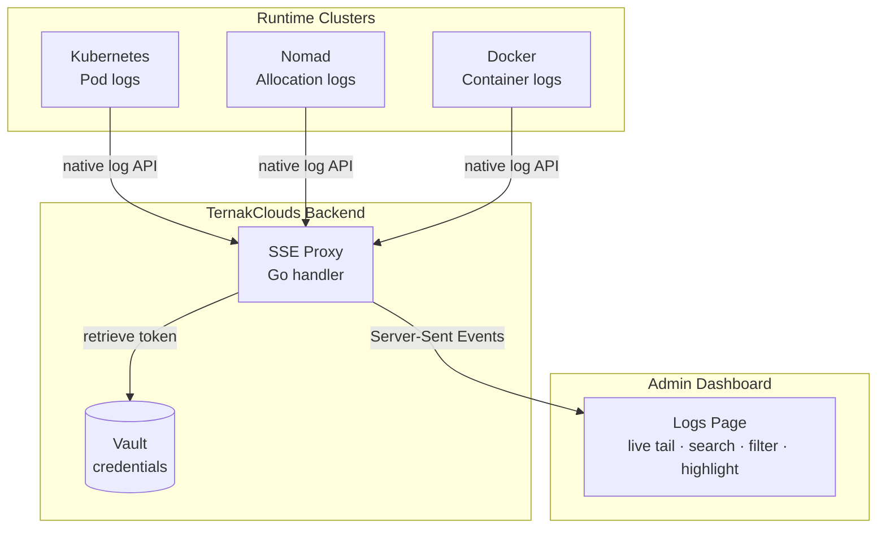
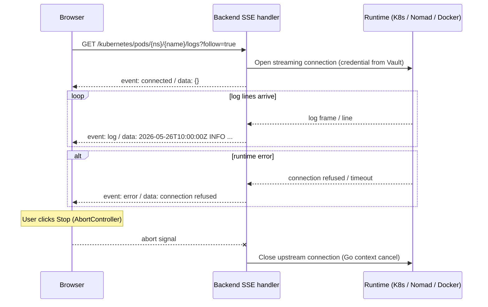

# Logs Platform

TernakClouds provides centralized, runtime-agnostic log streaming. Developers can tail, search, and filter logs from any workload without `kubectl logs`, direct Nomad allocation access, or infrastructure knowledge.

---

## Architecture



The backend proxies directly to runtime log APIs (Kubernetes pod logs, Nomad client allocation logs, Docker container logs) and re-emits them as SSE events. As long as a runtime provider is bound to the environment, live log streaming is available — no additional configuration required.

---

## Live Streaming

The platform opens a streaming connection to the runtime API and forwards log lines in real time.

- **Kubernetes:** proxies `kubectl logs --follow` via the Kubernetes API server
- **Nomad:** proxies allocation log streaming via the Nomad client HTTP API
- **Docker:** proxies `docker logs --follow` via the Docker daemon API

---

## Using the Logs Page

Navigate to any environment → **Logs** in the sidebar.

### Controls

| Control | Description |
|---|---|
| **Runtime** | Select the runtime provider (Kubernetes, Nomad, or Docker) |
| **Namespace** | Filter workloads by namespace (Kubernetes/Nomad; dropdown populated from the cluster) |
| **Workload** | Select a pod (Kubernetes), job (Nomad), or container (Docker) |
| **Container** | Select a container within the pod (Kubernetes; auto-populated) |
| **Task** | Select a task within the job (Nomad; auto-populated from job definition) |
| **Source** | `stdout` or `stderr` |
| **Stream** | Start live tailing |
| **Stop** | Stop the stream |

### Streaming

Click **Stream** to begin live log tailing. The terminal shows:

- `idle` — not streaming
- `connecting…` — stream opening
- `live` (pulsing dot) — connected and receiving logs
- Error message — stream failed

Logs are capped at 3,000 lines. Older lines are dropped as new ones arrive to prevent memory growth.

### Search and Filter

Use the **Search** bar in the terminal toolbar to filter displayed log lines:

- Type a search term and press `Enter` or click **Search**
- Only lines containing the term are shown
- Matching text is highlighted in yellow
- The line counter shows `N / Total` when a filter is active
- Press `Escape` or click `✕` to clear the filter

Search is purely client-side — it filters the lines already received in the browser.

---

## SSE Protocol

The backend uses Server-Sent Events for all log streaming.



---

## Kubernetes Log Streaming Detail

```
GET /kubernetes/pods/{namespace}/{name}/logs?container={container}&follow=true
Authorization: Bearer <platform-token>
```

The backend:
1. Retrieves the Kubernetes service account token from Vault
2. Opens: `GET {k8s-api}/api/v1/namespaces/{ns}/pods/{name}/log?container={c}&follow=true`
3. Reads line-by-line with `bufio.Scanner`
4. Emits each line as `event: log`

The `container` parameter is required. Available container names are returned in the pod detail response and shown in the Container dropdown.

---

## Nomad Log Streaming Detail

```
GET /nomad/allocations/{allocID}/logs?task={task}&type=stdout&follow=true&origin=start
Authorization: Bearer <platform-token>
```

The backend:
1. Retrieves the Nomad ACL token from Vault
2. Opens: `GET {nomad}/v1/client/fs/logs/{allocID}?task={task}&type={type}&follow={follow}&origin={origin}`
3. JSON-decodes `LogFrame` objects (base64-encoded log content)
4. Decodes and splits by newlines
5. Emits each line as `event: log`

**Allocation resolution:** The Logs page automatically resolves the latest running allocation from a job ID. It fetches allocations for the selected job, prefers `ClientStatus=running`, and sorts by `ModifyTime` descending.

**Task discovery:** When a Nomad workload is selected, the platform fetches the job detail and extracts task names from `TaskGroups[].Tasks[]`. These populate the Task dropdown automatically.

---

## Docker Log Streaming Detail

```
GET /docker/containers/{id}/logs?follow=true&timestamps=true&tail=100
Authorization: Bearer <platform-token>
```

The backend:
1. Retrieves the Docker daemon connection config from Vault (if token is set)
2. Opens: `GET {docker}/containers/{id}/logs?follow=true&timestamps=true`
3. Strips Docker's 8-byte stream-multiplexing header from each frame
4. Emits each line as `event: log`

Docker muxes stdout and stderr into a single stream with a 4-byte header (stream type + length). The backend demuxes this transparently, so log lines arrive as plain text in the SSE stream.

---

## Structured Log Recommendations

For the best experience with search and filter features, applications should emit structured JSON logs:

```json
{
  "timestamp": "2026-05-26T10:00:00Z",
  "level": "error",
  "service": "payments",
  "message": "database timeout after 30s",
  "traceId": "abc123",
  "requestId": "req-456"
}
```

Recommended fields:
- `timestamp` — ISO 8601
- `level` — `debug`, `info`, `warn`, `error`
- `service` — service name
- `message` — human-readable description
- `traceId` — for correlation
